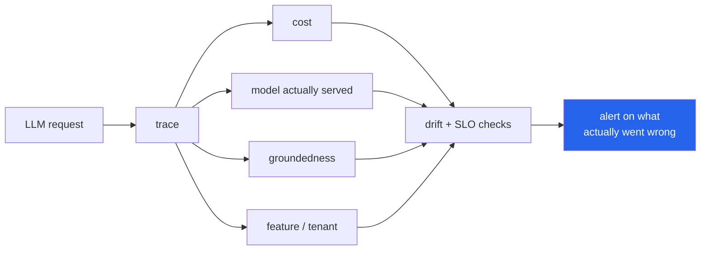

<h1 align="center">llm-observability-platform (Python · PSI drift detection · cost telemetry)</h1>
<p align="center"><i>Monitoring built for LLM applications, not retrofitted from web monitoring</i></p>

<p align="center">
  <a href="#four-ideas-the-rest-of-this-follows-from">Four ideas</a> &middot;
  <a href="#usage">Usage</a> &middot;
  <a href="#it-monitors-the-rest-of-the-portfolio">Monitoring the portfolio</a> &middot;
  <a href="#limits">Limits</a> 
</p>

<p align="center">
  <a href="https://github.com/hammasbuilds/llm-observability-platform/actions/workflows/ci.yml"></a>
  
  
  
  <a href="LICENSE"></a>
</p>

---

## Four ideas the rest of this follows from



Generic tracing says a request took 800 ms. It does not say the 800 ms **cost $0.04, was
served by a fallback model, returned an ungrounded answer, and came from the one feature
losing money**. Those are fields here, not tags you have to remember to add.


### 1. Cost is attributed, never totalled

A single monthly spend figure is unactionable. **Cost per feature** tells you what to
switch off. **Cost per *successful* outcome** tells you whether it was ever worth
running:

```python
obs.top_spend("feature")
# [{"feature": "doc_summary", "total_usd": 5.00, "calls": 5,
#   "usd_per_success": None, "error_rate": 1.0}]   ← expensive AND broken
```

Ranking on total spend alone just promotes whatever is popular. The pair is what
identifies a feature that is both costly and ineffective.

### 2. Percentiles, never means

A mean latency of 400ms is equally consistent with *everyone waits 400ms* and with
*95% wait 100ms while 5% wait six seconds*. Only one of those is a problem, and the
mean cannot tell them apart.

Cache hits are **excluded** from latency percentiles. A 2ms cache hit makes the model
look fast and hides the tail that users on a miss actually experience — that is a test.

### 3. Prompt drift, without storing prompts

The failure nobody instruments: a system is built and tuned against one kind of input,
three months later users are asking something different, quality quietly falls, and
**no error is ever raised because nothing errored**.

Detected with **Population Stability Index** — the standard measure in credit risk for
"has the input distribution moved", implemented in pure Python because it is a handful
of logarithms:

```
PSI < 0.10   stable
0.10–0.25    moderate shift
> 0.25       significant shift
```

The prompt text is **never stored**. What is stored is its shape — question type,
length bucket, and a hash of the structural skeleton with content words removed:

```python
signature("What is the capital of Pakistan?")
signature("What is the capital of Morocco?")
# identical — same kind of question, different subject
```

Enough to see the distribution move. Useless to anyone who obtains it. "We only keep
prompts for debugging" is how medical questions and support tickets end up somewhere
they should not be.

### 4. Alerts people do not mute

Every rule carries a **sample floor** and a **cooldown**, and is **relative to a
baseline** where one exists. "Error rate above 5%" is the wrong alarm for a service
that normally runs at 6%, and the right one for a service that normally runs at 0.1%.

Rules are evaluated **per feature as well as globally**, because one broken feature is
invisible inside a healthy aggregate:

```python
def test_one_broken_feature_is_visible_despite_a_healthy_aggregate():
    # 2000 healthy calls + 50 calls from a feature failing 100% of the time
    assert obs.summary()["error_rate"] < 0.05          # aggregate looks fine
    assert any(a.scope == "feature:broken" for a in obs.check_alerts())
```

## Usage

```python
from llmobs import Observatory, LLMCall

obs = Observatory(sink=Path("runs/calls.jsonl"))

obs.record(
    LLMCall(feature="search", tenant="acme", model="claude-sonnet-5",
            prompt_tokens=820, completion_tokens=140, usd=0.0046,
            latency_ms=980, grounding=0.82, fallback_used=True),
    prompt=user_question,      # signature derived, text discarded
)

obs.summary(3600)          # percentiles, rates, cost per success
obs.by("feature")          # the same, broken out
obs.top_spend("feature")   # what to switch off
obs.drift()                # PSI across prompt shape, model mix, latency, cost
obs.check_alerts()         # global and per-feature
```

Windows are **time-based, not count-based**: a count window compares last week's
thousand calls against today's thousand and reports a traffic change as a quality
change.

Drift compares **adjacent** windows, not window-against-all-history — history includes
the current window and dilutes exactly the change being looked for.

## It monitors the rest of the portfolio

`LLMCall` maps directly onto what
[`llm-gateway`](https://github.com/hammasbuilds/llm-gateway) already records
(model, provider, cost, fallback) and what
[`rag-forge`](https://github.com/hammasbuilds/rag-forge) already produces
(grounding score, refusal). Point one at the other and the projects stop being
separate demos.

## Tests

**53 tests (49 core + 4 for the optional Streamlit demo).** No numpy, no network, no model.

```bash
make test
```

| Covered | |
|---|---|
| Percentiles | tail visibility, empty and single-sample windows |
| Aggregation | cache exclusion, cost per success, `None` grounding ≠ zero grounding, tool errors per call not per request |
| PSI | identical, shifted, empty buckets, constant reference, mismatched shapes |
| Signatures | irreversibility, shape matching, question types |
| Drift | insufficient data, real shift detected, stable traffic not flagged |
| Alerts | sample floor, relative thresholds, cooldown, per-scope isolation, hidden broken feature |

## Limits

- In-process and in-memory, with a JSONL sink. Production would put the window in
  ClickHouse or TimescaleDB; the aggregation logic does not change.
- PSI detects that a distribution moved, not **why**. It is a trigger for
  investigation, not a diagnosis.
- Prompt signatures are structural. Two prompts with identical shape and opposite
  meaning look the same — deliberate, and the price of not storing prompts.
- Grounding must be supplied by the caller. This platform measures it; it does not
  compute it.

## Keywords

LLM observability &middot; LLMOps &middot; tracing &middot; cost tracking &middot; token accounting &middot; drift detection &middot; PSI &middot; population stability index &middot; SLO &middot; groundedness &middot; monitoring &middot; alerting &middot; percentiles &middot; latency &middot; production LLM &middot; zero dependencies &middot; Streamlit

## License

MIT

---

## Run it yourself

```bash
git clone https://github.com/hammasbuilds/llm-observability-platform
cd llm-observability-platform

uv sync --all-groups     # or: pip install -e ".[dev]"
make test                # 53 tests, no numpy, no network, no model
```

```python
from pathlib import Path
from llmobs import Observatory, LLMCall

obs = Observatory(sink=Path("runs/calls.jsonl"))

obs.record(
    LLMCall(feature="search", tenant="acme", model="claude-sonnet-5",
            prompt_tokens=820, completion_tokens=140, usd=0.0046,
            latency_ms=980, grounding=0.82, fallback_used=True),
    prompt=user_question,        # signature derived, the text is discarded
)

obs.summary(3600)        # percentiles, rates, cost per success
obs.top_spend("feature") # what to switch off
obs.drift()              # PSI across prompt shape, model mix, latency, cost
obs.check_alerts()       # global and per feature
```

`LLMCall` maps onto what [`llm-gateway`](https://github.com/hammasbuilds/llm-gateway)
already emits and what [`rag-forge`](https://github.com/hammasbuilds/rag-forge) already
produces, so pointing one at the other needs no adapter.

### Input / Output


`python demo.py`


Nothing drifted in any of those 1,200 trials. Both windows in every trial come from the
same generator with no shift applied, so every alarm is false by construction.

At n=150 the metric raises one **64% of the time**, and its worst draw reaches 0.3887 —
past the *significant shift* threshold, not merely the moderate one. At n=500 it never
fires. A PSI threshold on a low-traffic feature is a scheduled false alarm.
